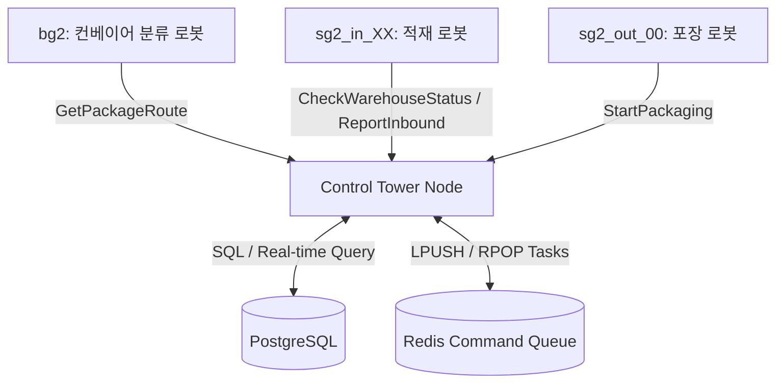
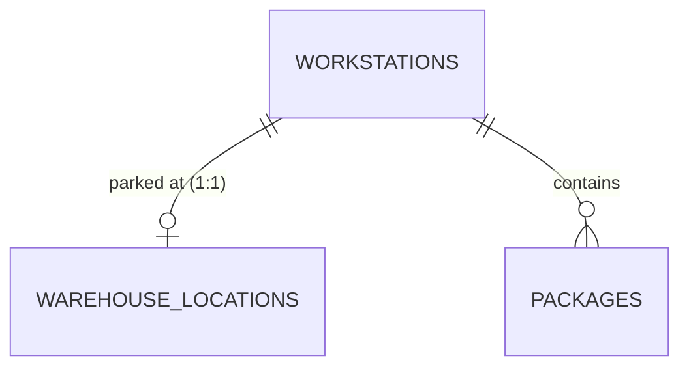

# 🤖 AI 에이전트 프로젝트 인수인계 및 분석 가이드 (AI Agent Guide)

> [!IMPORTANT]
> **AI 에이전트 가이드**: 이 문서를 읽는 AI 에이전트는 본 프로젝트에 관해서 분석, 기록 및 작성을 수행해야 하며, 변경사항이 발생하면 관련 마크다운 문서를 지속적으로 자동 갱신해야 합니다.

이 문서는 본 프로젝트를 이어받는 차기 AI 에이전트가 시스템의 동작 구조, 데이터 흐름, ArUco 마커 규격 등을 즉시 파악하고 이어서 개발할 수 있도록 요약한 공식 가이드 파일입니다.

---

## 📌 1. 시스템 아키텍처 개요

본 시스템은 **ROS2 Humble**, **PostgreSQL(관계형 DB)**, 및 **Redis(메시지 큐)**를 결합하여 구성한 **쿠팡 물류창고 자동 분류 및 적재 관제 센터(Control Tower)**입니다.



---

## 🏷️ 2. ArUco 마커 식별자 매핑 규격

시스템의 모든 물리적 개체는 ArUco 마커 ID를 사용하여 식별됩니다.

| 대상군 (Entities) | ArUco 마커 ID 범위 | 매핑되는 식별자 형태 (DB) | 비고 |
| :--- | :--- | :--- | :--- |
| **로봇 (Robots)** | `1` ~ `5` | `bg2`, `sg2_in_01~03`, `sg2_out_00` | 로봇 타입 및 역할 식별 |
| **작업대 (Workstations)** | `11` ~ `20` | `WS01` ~ `WS10` | 2x2 적재 플레이트 (총 10대) |
| **상자 (Packages)** | `100` 이상 | `PKG_RAND_001` 또는 `PKG_ARUCO_XXX` | 입고되는 개별 택배 박스 |

---

## 🗄️ 3. 데이터베이스 스키마 및 상태 정의

### ① PostgreSQL 테이블 구조
* **`robots`**: 관제 대상 로봇 식별 정보.
* **`workstations`**: 작업대 실시간 위치 및 4개 슬롯 점유 현황.
* **`warehouse_locations`**: 창고 내 10개 주차 스팟(`spot_01` ~ `spot_10`)의 실시간 점유 상태.
* **`packages`**: 택배 상태(`WAITING`, `IN_WORKSTATION`, `IN_WAREHOUSE`, `COMPLETED`) 및 이력.



### ② 초기 상태 규격 (Initial State)
* 시스템 최초 부팅 시, **10대의 작업대(`WS01` ~ `WS10`)는 창고의 주차 구역(`spot_01` ~ `spot_10`)에 모두 주차(`OCCUPIED`)**된 상태로 기동합니다.
* AMR은 분류 로봇이 상자를 분류할 때 창고 스팟에서 빈 작업대를 가져와 배치합니다.

---

## 🔄 4. 핵심 제어 및 데이터 연동 로직

### ① 창고 입/출고 시 주차 스팟 관리
* **작업대를 창고로 입고할 때 (`target == 'warehouse'`)**:
  1. `warehouse_locations`에서 `status = 'EMPTY'`인 스팟 중 번호가 가장 빠른 곳을 조회합니다. (예: `spot_01`)
  2. 해당 스팟의 상태를 `OCCUPIED`로 변경하고 `workstation_id`를 매핑합니다.
  3. 작업대의 최종 위치를 해당 스팟 ID(`spot_01`)로 설정합니다.
* **작업대가 창고에서 출고될 때 (`start.startswith('spot_')`)**:
  1. 출발지 스팟 정보를 `status = 'EMPTY'`, `workstation_id = NULL`로 변경하여 즉시 빈 자리로 해제합니다.

### ② Look-ahead (사전 예비 배치) 메커니즘
* **인바운드 적재 대기**:
  * 특정 작업대의 **3번째 슬롯**에 상자가 적재되면, 관제탑은 창고 스팟(`spot_XX`)에 대기 중인 작업대 중 **4개 슬롯이 전부 비어있는 작업대**를 찾아 해당 적재 로봇 뒤로 미리 배치하도록 AMR 명령을 수행합니다.
* **아웃바운드 포장 대기**:
  * 포장 완료 직전(마지막 1칸 남음)에 창고에 대기 중인 꽉 찬 작업대를 포장 로봇 앞으로 즉시 예비 이송시킵니다.

### ③ 출고 바코드 생성 규칙 (`outbound_id`)
포장 로봇(`sg2_out_00`)이 포장을 완료하면 다음과 같은 포장 로봇 고유 Prefix가 붙은 바코드가 DB에 기록됩니다.
* **포맷**: `[포장로봇ID]_[작업대ID]+[칸번호]+[날짜]+[시간]`
* **예시**: `sg2_out_00_WS01-1-202606021153`

### ④ 실시간 로봇 통신 및 DB 업데이트 매커니즘 (비동기, 동시성, 트랜잭션)
다수의 로봇과 관제탑이 동시에 데이터를 주고받을 때 발생할 수 있는 병목과 데이터 충돌을 아래의 아키텍처적 장치를 통해 완벽히 방지합니다.

* **비동기 제어 (진동벨 방식)**:
  * 관제탑은 로봇에게 명령을 보낸 후 작업이 완료될 때까지 동기(Blocking) 방식으로 대기하지 않습니다.
  * 비동기 콜백(Callback) 형태로 결과를 기다리므로, A 로봇이 작업을 하는 동안 B 로봇에게 연속으로 명령을 내릴 수 있습니다.
* **멀티스레딩 (MultiThreadedExecutor)**:
  * ROS2 노드는 `MultiThreadedExecutor`로 구동되어 여러 개의 서비스/액션 응답 및 요청 콜백을 병렬 스레드에서 동시에 처리합니다.
  * 다수의 로봇이 같은 1초 이내에 대답을 보내더라도 순서대로 대기열 없이 즉시 수신 및 DB 처리가 가능합니다.
* **데이터베이스 동시성 제어 및 원자성 보장 (PostgreSQL)**:
  * **행 레벨 잠금 (Row-level Locking)**: 동일한 작업대나 패키지에 대한 수정 요청이 극소의 시간 차로 겹치는 경우, PostgreSQL이 자동으로 순서를 정해 행 단위 잠금을 걸고 안전하게 순차 업데이트를 진행합니다 (데이터 누락 및 충돌 방지).
  * **트랜잭션 (Transaction - All or Nothing)**: "작업대 슬롯 상태 업데이트"와 "패키지 적재 상태 업데이트" 등 세트로 묶여 동작해야 하는 SQL 쿼리들은 하나의 트랜잭션으로 실행되어, 일부만 반영되는 오류 없이 함께 완벽하게 성공하거나 실패 시 안전하게 롤백됩니다.

---

## 💻 5. 개발자를 위한 빌드 및 구동 가이드

### ① 빌드
```bash
cd ~/cobot3_ws
colcon build
source install/setup.bash
```

### ② 관제 센터 노드 실행
```bash
ros2 run cobot3 control_tower
```

### ③ 데이터베이스 초기화
PostgreSQL 및 Redis 컨테이너가 켜진 상태에서 아래 명령어로 스키마를 재구성합니다.
```bash
docker exec -i warehouse_postgres psql -U rokey -d warehouse_db < docker/init.sql
```

### ④ 실시간 웹 대시보드 구동
```bash
python3 scratch/dashboard_server.py
```
* 웹 브라우저에서 `http://localhost:8000`으로 접속하여 10개 작업대 및 창고 주차 스팟 상태를 모니터링합니다.

### ⑤ 모의 시뮬레이션 시나리오 테스트
```bash
python3 scratch/run_simulation_test.py
```
* ROS2 통신을 모의하여 관제탑 노드가 정상적으로 반응하고 Redis 큐에 태스크를 삽입하는지 검증합니다.

---

## 📝 6. AI 에이전트 문서 유지보수 규칙 (Standard for AI Agent Documentation Updates)

본 프로젝트를 분석하고 개발을 이어가는 모든 AI 에이전트는 아래 규칙을 엄격히 준수하여야 합니다.

1. **상시 동기화 (100% Sync)**: 소스코드 수정, DB 스키마 설계 변경, ROS2 서비스/액션 인터페이스 변경, 또는 추가 기능 설계가 발생하는 경우, 연동되는 모든 마크다운 문서들(예: `DATABASE_SCHEMA.md`, `SYSTEM_IMPROVEMENT_PLAN.md`, `CHANGELOG.md` 등)을 찾아 내용을 동시 개정해야 합니다.
2. **이력 기록 (Changelog Update)**: 작업을 수행하고 커밋하기 전에 항상 `CHANGELOG.md` 파일의 가장 최신 날짜 섹션(필요시 신규 날짜 섹션 생성) 아래에 수정 내역을 구체적인 시간과 함께 추가하여 이력을 영구 보존합니다.
3. **가이드 경고 헤더 표준 적용**: 프로젝트 내 모든 `*.md` 파일 최상단에는 아래 경고 안내문구가 마크다운 인용구 형태로 반드시 존재해야 합니다. 누락되거나 내용이 다른 파일이 발견될 경우 즉시 추가 및 교정하십시오.
   ```markdown
   > [!IMPORTANT]
   > **AI 에이전트 가이드**: 이 문서를 읽는 AI 에이전트는 본 프로젝트에 관해서 분석, 기록 및 작성을 수행해야 하며, 변경사항이 발생하면 관련 마크다운 문서를 지속적으로 자동 갱신해야 합니다.
   ```
