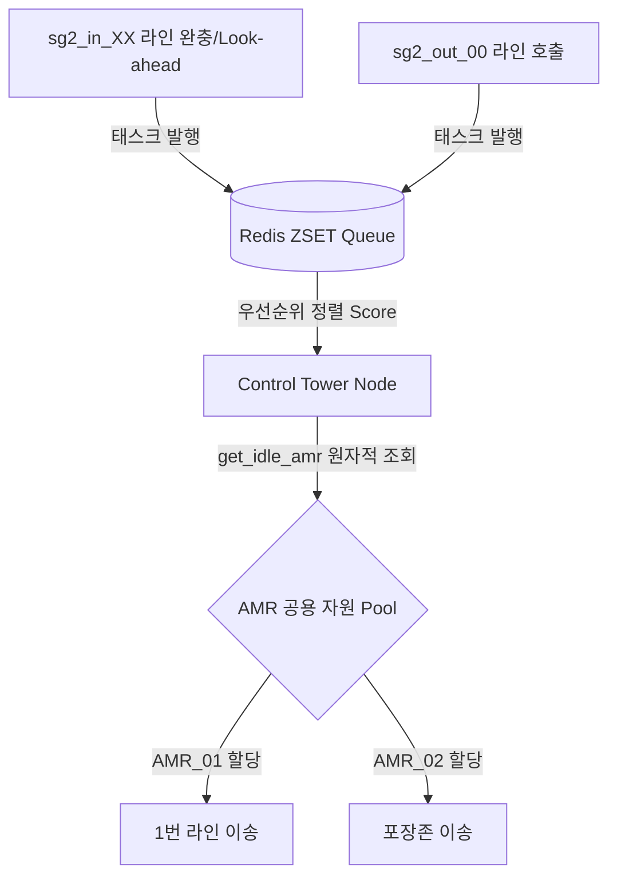

# 🚚 AMR 동적 풀링(Dynamic Pooling) 관제 운영 고도화 계획서

> [!IMPORTANT]
> **시스템 아키텍처 가이드**: 본 문서는 기존 쿠팡 물류창고 관제 시스템의 하이브리드 인프라(PostgreSQL + Redis ZSET 우선순위 큐)를 기반으로, AMR 운용 방식을 '라인 전담형'에서 '동적 풀링(Dynamic Pooling)' 방식으로 전환하기 위한 설계 및 구현 가이드입니다.

---

## 📌 1. 개요 (Overview)
기존의 라인별 AMR 전담 배치 방식에서 탈피하여, 모든 AMR(AMR_01~05)을 하나의 **공용 자원 풀(Pool)**로 통합 관리합니다. 관제탑(Control Tower)이 실시간 물동량 변화(오늘/내일/모레 물량)를 감지하고, Redis 우선순위 큐를 통해 가장 긴급한 라인에 AMR을 동적으로 할당하여 물류 처리 효율성을 극대화합니다.

## ⚙️ 2. 시스템 아키텍처 연동 구조
동적 풀링 방식은 기존 백엔드 인프라를 그대로 활용하며, 관제탑의 스케줄링 분기 및 로봇 배정 로직을 고도화합니다.



### ① Redis Sorted Set (ZSET) 활용
태스크 종류에 따른 가중치(Score)를 기반으로 실시간 정렬 실행
주요 태스크 우선순위 배정:
* `DIRECT_WAREHOUSE`, `RETRIEVE_FULL_WORKSTATION`, `ROTATE_WORKSTATION`: 100점 (최우선 처리)
* `DEPLOY_EMPTY_WORKSTATION`: 90점
* `FETCH_FOR_PACKAGING`: 80점

### ② PostgreSQL 관계형 DB 상태 관리
`workstations` 테이블의 `reserved_by` 필드를 활용하여 어떤 AMR이 해당 작업대를 선점했는지 실시간 동기화하여 데이터 정합성 유지

---

## 🔄 3. 핵심 프로세스 및 AMR 동선 흐름
A/B 듀얼 스테이션(버퍼) 레이아웃의 장점과 동적 풀링을 결합한 최적의 파이프라이닝 흐름입니다.

1. **대기(Standby) 상태**: 각 입고 라인의 `_A`(Active) 구역에서는 적재가 진행 중이며, `_B`(Standby) 구역에는 예비 빈 작업대가 배치되어 있습니다. AMR 풀의 로봇들은 대기소나 충전소에서 IDLE 상태로 대기합니다.
2. **트리거 (A구역 8칸 완충 시)**: 관제탑이 `RETRIEVE_FULL_WORKSTATION` 태스크를 Redis 큐에 발행합니다.
3. **AMR 배정 및 선행 처리**: 풀에서 IDLE 상태인 가장 적절한 AMR이 배정됩니다. AMR은 `_A` 구역으로 진입하여 완충된 작업대를 리프트한 후, 곧바로 창고(`spot_XX`)나 출고존(`sg2_out_00_A`)으로 장거리 이송을 시작합니다. (옆으로 빼서 내려놓는 불필요한 공정을 생략하여 택타임 단축)
4. **B구역 승격(Promotion)**: `_A` 구역이 비는 즉시, 해당 라인의 로봇 팔 정체를 막기 위해 `_B` 구역에 있던 대기 작업대를 `_A` 구역으로 즉시 이동(Promotion)시킵니다. (1.5m 근거리 이동으로 즉시 완료)
5. **B구역 보충**: AMR은 창고의 공용 예비대에서 새로운 빈 작업대를 픽업하여 해당 라인의 `_B` 구역에 다시 채워 넣고 IDLE 상태로 복귀합니다.

---

## 💻 4. 핵심 소스 코드 수정 가이드

### ① 원자적 로봇 조회 및 락(Lock) 처리 (`control_tower_node.py` 보강)
동적 풀링 시 여러 태스크가 하나의 IDLE 로봇에게 동시에 배정되는 Race Condition을 방지하기 위해 `get_idle_amr()` 및 배정 로직에 즉각적인 상태 변경(Locking)을 도입해야 합니다.

```python
def allocate_amr_to_task(self, task):
    """Redis를 활용하여 원자적으로 IDLE 로봇을 조회하고 즉시 RESERVED로 잠금"""
    with self.trigger_lock:  # 스레드 락 적용
        amr_id = self.get_idle_amr()
        if amr_id:
            # 찾은 즉시 Redis 상태를 업데이트하여 타 스레드에서 접근 불가하도록 방어
            self.redis_client.hset(f"amr:{amr_id}", "state", "RESERVED")
            task['assigned_amr'] = amr_id
            self.get_logger().info(f"[풀링 배정] 태스크 {task['task_type']} ➡️ {amr_id} 배정 및 잠금 완료")
            return amr_id
        return None
```

### ② `dispatch_workstations_keepalive` 내 듀얼 버퍼 스케줄링 확장

```python
# 입고 라인별 A/B 구역 상시 감시 및 공급
for line in inbound_lines:
    # A구역 공백 시 최우선 보충
    if not line_status[line]['A'] and not line_status[line]['MOVING_A']:
        self.enqueue_deploy_task(line, f"{line}_A", score=95)
    
    # 파트너님 제안 반영: A구역은 차있으나 B구역(Standby)이 비어있을 때 미리 채워두기
    elif line_status[line]['A'] and not line_status[line]['B'] and not line_status[line]['MOVING_B']:
        if not self.is_task_queued('DEPLOY_EMPTY_WORKSTATION', target=f"{line}_B"):
            self.get_logger().info(f"[Dual-Buffer] {line} 예비 B구역 공백 감지, 공용 풀에 조달 요청 발행")
            self.enqueue_deploy_task(line, f"{line}_B", score=90)
```

---

## ⚠️ 5. 잠재적 위험 요인 및 Fail-Safe 대책

| 위험 요인 (Risks) | 발생 원인 (Causes) | 해결 및 방어 대책 (Mitigations) |
| :--- | :--- | :--- |
| **동시성 경쟁 (Race Condition)** | 1초 주기의 타이머 루프와 비동기 콜백이 겹쳐 동일 AMR에 다중 명령 하달 | 스레드 세이프 락(`threading.Lock`) 및 Redis `RESERVED` 상태 플래그 선행 주입 |
| **물리적 경로 교착 (Traffic Deadlock)** | 공용 풀의 여러 AMR이 동시에 특정 라인 길목(좁은 Pathway)에 진입하여 대치 | 1. Odometry 기반 미터법 좌표 연산 주행 적용<br>2. 관제탑 단에서 핵심 교차로 격자 노드에 대한 '노드 선점 권한(Grid Lock)' 제어 로직 추가 |
| **특정 라인 공정 정체 (Starvation)** | 오늘 물량 라인이 너무 바빠 AMR 풀이 고갈되어 내일 라인의 작업대 회수가 지연됨 | 태스크 대기 시간(Age)에 따라 우선순위 점수를 동적으로 가산하는 Aging 알고리즘 도입 |

---

## 📈 6. 도입 기대 효과 (Expected Benefits)
1. **AMR 가동률 극대화**: 작업량이 적은 라인의 전담 AMR이 노는 현상을 완벽히 차단하여 로봇 자원 효율 40% 이상 향상.
2. **데모 및 시뮬레이션 경쟁력 확보**: 특정 라인에 병목 발생 시 공용 풀의 AMR들이 유기적으로 지원을 나가는 지능형 관제 연동 시각화 완성 (FastAPI 대시보드에서 실시간 모니터링 가능).
