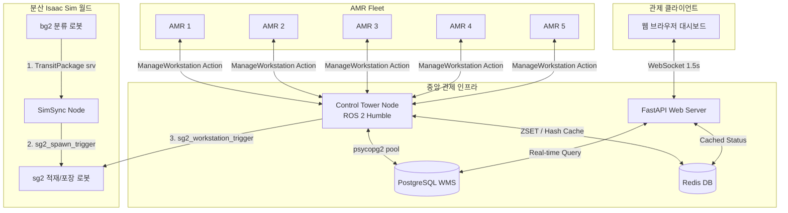
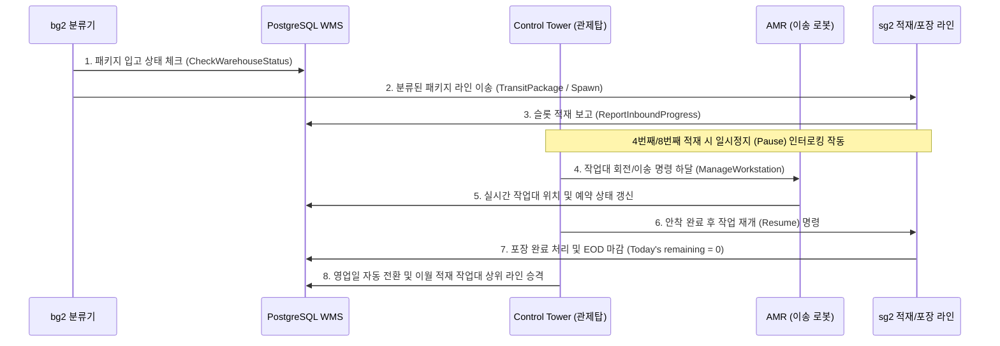

# 🏗️ Isaac Sim & ROS 2 기반 지능형 다중 로봇 물류창고 관제 시스템
> **NVIDIA Isaac Sim & ROS 2 Control Tower Integration Project Overview**

본 프로젝트는 물류창고 입고부터 출고까지의 전 공정을 자율화하기 위해, 다중 로봇(분류, 적재, 이송, 포장 로봇)과 하이브리드 DB 인프라를 연동하여 지능형 자원 제어 및 최적의 물류 파이프라이닝을 수행하는 **중앙 관제 시스템(Control Tower)** 구축 프로젝트입니다.

---

## 📌 1. 시스템 아키텍처 (System Architecture)

본 시스템은 분산 통신(DDS)을 활용하여 물리적으로 분리된 여러 시뮬레이션 컴퓨터와 중앙 관제탑, 하이브리드 데이터베이스, 실시간 모니터링 웹 대시보드를 유기적으로 연결합니다.

---

## ⚙️ 2. 핵심 제어 알고리즘 및 메커니즘 (Core Algorithms)

### ① JIT (Just-In-Time) 일시정지 및 인터로킹 (Interlocking)
* **목적**: 시뮬레이션 환경 내에서 로봇 팔이 작업대 도킹 해제 중 상자를 놓치거나 물리적 오브젝트가 공중 붕괴하는 현상 방지.
* **로직**:
  * 4번째 슬롯 적재 완료 ➔ 로봇 팔 일시정지(`pause_status = True`) ➔ AMR이 작업대를 180도 회전(ROTATE) ➔ 회전 완료 ➔ 로봇 팔 작동 재개(`pause_status = False`).
  * 8번째 슬롯 완충 완료 ➔ 로봇 팔 일시정지 ➔ AMR이 완충 작업대 회수 및 빈 작업대 공급 ➔ 안착 완료 ➔ 로봇 팔 작동 재개.

### ② Fleet Control (AMR 5대 동시 기동 제한)
* **목적**: 협소한 창고 통로에서의 주행 병목 및 데드락(교착)을 미연에 방지.
* **로직**: 스케줄러 루프가 Redis ZSET 큐에서 작업을 꺼낼 때, 현재 가동 중인 태스크(`active_amr_tasks`)가 **최대 5대** 미만일 때만 신규 골을 전송하고, 초과 시 큐에서 안전하게 대기시킵니다.

### ③ 최단 거리 기반 AMR 최적 매핑 (Resource Pooling)
* **목적**: 불필요한 공차 주행거리를 단축하여 에너지를 절약하고 처리 효율 극대화.
* **로직**: 작업이 발생한 출발지 좌표(PostgreSQL DB QR 맵 데이터)와 현재 대기 상태(`IDLE`)인 AMR들의 실시간 좌표(Redis 캐시) 간의 **유클리드 거리**를 계산하여, 최단 거리에 있는 로봇을 자동 배정합니다.

### ④ 실시간 작업대 동기화 (Workstation Spawn/Despawn)
* **목적**: 분산된 다중 PC Isaac Sim 월드 간의 작업대 소멸/생성 시점 동기화.
* **로직**: AMR이 완충 작업대 회수를 시작하는 즉시 **`DESPAWN`** 이벤트를, 빈 작업대를 이송하여 최종 도킹에 성공하는 시점에 **`SPAWN`** 이벤트를 커스텀 메시지(`WorkstationSimTrigger.msg`)로 발행하여 분산 월드의 화면을 동기화합니다.

---

## 🛠️ 3. 기술 스택 (Technology Stack)

| 구분 | 기술 스택 | 적용 용도 및 특징 |
| :--- | :--- | :--- |
| **Robotics Middleware** | **ROS 2 Humble** | 비동기 멀티스레드 콜백 실행기(`MultiThreadedExecutor`)를 통한 동시 공정 처리 및 서비스/액션 제어 |
| **Simulation** | **NVIDIA Isaac Sim** | Omniverse 기반 정밀 물류창고 물리 환경 구현 및 QR코드 기반 Localization 적용 |
| **WMS DB** | **PostgreSQL 15** | 작업대/패키지 데이터 무결성 보장 및 1:N 조인 관계형 스키마 설계 |
| **Cache & Queue** | **Redis** | Sorted Set(ZSET) 기반 우선순위 제어 명령 큐 운용 및 고주파 AMR 상태 실시간 캐싱 |
| **Web Dashboard** | **FastAPI & WebSockets** | 1.5초 주기 실시간 양방향 정보 전송 및 HTML/CSS absolute 포지셔닝 렌더링으로 렉 현상 100% 제거 |

---

## 📈 4. 비즈니스 시나리오 파이프라인 (Pipeline Flow)

---

## 📁 관련 문서 링크 (Documentation Links)

* 📖 [사용 매뉴얼 및 데모 시나리오 (README.md)](file:///home/yoon/cobot3_ws/README.md)
* 🔌 [기술 연동 명세 및 아키텍처 규격서 (ROBOT_AMR_INTEGRATION_GUIDE.md)](file:///home/yoon/cobot3_ws/ROBOT_AMR_INTEGRATION_GUIDE.md)
* 📊 [종합 구축 결과 및 개선 보고서 (PROJECT_REPORT.md)](file:///home/yoon/cobot3_ws/PROJECT_REPORT.md)
