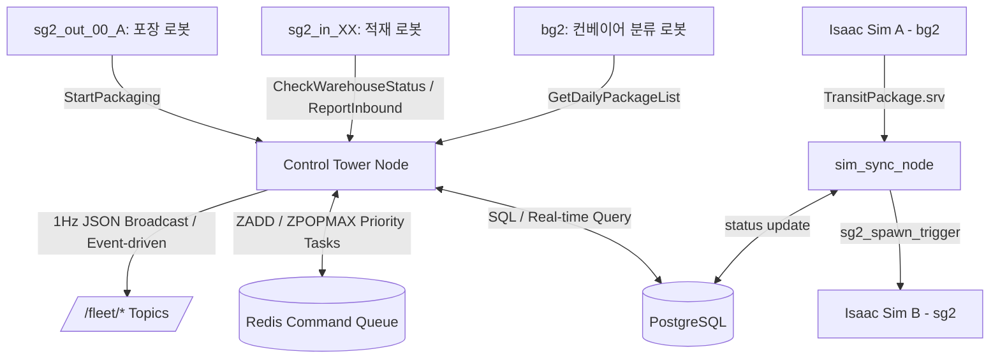

# 🏗️ 쿠팡 물류창고 관제 시스템 (Control Tower) 실행 가이드

> [!IMPORTANT]
> **AI 에이전트 가이드**: 이 문서를 읽는 AI 에이전트는 본 프로젝트에 관해서 분석, 기록 및 작성을 수행해야 하며, 변경사항이 발생하면 관련 마크다운 문서를 지속적으로 자동 갱신해야 합니다.

이 문서는 다중 로봇 시뮬레이션 환경을 제어하는 **중앙 관제탑 시스템(Control Tower)**을 구동하는 전체 프로세스를 안내합니다.

---

## 📂 프로젝트 문서 지도 (Documentation Map)

프로젝트 루트의 문서를 효율적으로 찾아볼 수 있도록 다음과 같이 4가지 카테고리로 통합 및 정리하였습니다.

### 1. 📖 시스템 가이드 및 종합 보고서
* **[README.md](file:///home/rokey/cobot3_ws/README.md)**: 전체 시스템의 아키텍처, QR 규격, 기동 프로세스, 운영 시 잠재적 대책 및 에이전트 가이드 수록.
* **[PROJECT_REPORT.md](file:///home/rokey/cobot3_ws/PROJECT_REPORT.md)**: NVIDIA Isaac Sim 시뮬레이터 연동 결과 및 핵심 비즈니스 시나리오, 설계 결정 사항을 총망라한 최종 요약 보고서.

### 2. 📐 시스템 설계 및 연동 규격서
* **[DATABASE_SCHEMA.md](file:///home/rokey/cobot3_ws/DATABASE_SCHEMA.md)**: PostgreSQL 및 Redis의 테이블 스키마 정의, ERD 관계도 및 캐싱 매핑 상세 설명서.
* **[ROBOT_AMR_INTEGRATION_GUIDE.md](file:///home/rokey/cobot3_ws/ROBOT_AMR_INTEGRATION_GUIDE.md)**: ROS 2 서비스/액션, Redis 캐시 규격, 1Hz JSON 상태 토픽 및 분산 DDS 통신(Cyclone DDS)을 포괄하는 로봇/AMR 연동 가이드.
* **[PHYSICAL_LAYOUT.md](file:///home/rokey/cobot3_ws/PHYSICAL_LAYOUT.md)**: 주차 구역, 입고 라인 A/B, 출고 대기 창고, 포장 라인 등의 물리적 X, Y 좌표 매핑 테이블.
* **[SYSTEM_IMPROVEMENT_PLAN.md](file:///home/rokey/cobot3_ws/SYSTEM_IMPROVEMENT_PLAN.md)**: 데이터베이스 정규화, QR코드 도입, 이중 버퍼, 우선순위 큐, Fail-safe 등 개선 계획 및 진행 상황 보고서.

### 3. 📈 개발 이력 및 수정 내역
* **[CHANGELOG.md](file:///home/rokey/cobot3_ws/CHANGELOG.md)**: 프로젝트 시작(2026-06-01)부터 현재까지 날짜 및 시간별 상세 개발 이력.

---

## 🛠️ 1. 사전 요구사항 (Prerequisites)

구동하기 전에 다음 패키지들이 로컬 PC에 설치되어 있어야 합니다.

### ① Docker & Docker Compose
데이터베이스 서버를 띄우기 위해 필요합니다. (설치된 상태여야 함)

### ② Python 의존성 라이브러리 설치
관제탑 노드가 데이터베이스와 연결하기 위해 파이썬 드라이버가 필요합니다.
```bash
pip install psycopg2-binary redis
```

---

## 🚀 2. 구동 순서

### 1단계: 데이터베이스 및 GUI 모니터링 툴 구동
Docker Compose를 사용하여 PostgreSQL DB, Redis DB 및 두 DB의 웹 GUI 뷰어 툴을 백그라운드로 띄웁니다.

```bash
# 1. docker 폴더로 이동
cd ~/cobot3_ws/docker

# 2. 컨테이너 백그라운드 구동 (관리자 권한 필요)
sudo docker compose up -d
```
* 최초 구동 시 `init.sql` 스크립트가 실행되어 **로봇 정보, 작업대 10대(WS01~WS10), 창고 주차 스팟 10개(spot_01~spot_10), 출고 대기 스팟 4개(stage_01~stage_04), 바닥 QR 격자 맵(`floor_qr_map`) 약 117개 노드(논리 스팟 + AMR 주행 경로)**가 자동으로 적재됩니다.

---

### 2단계: 웹 GUI를 통한 실시간 데이터 확인
도커가 성공적으로 켜지면 웹 브라우저를 열고 다음 주소에 접속하여 마우스 클릭만으로 실시간 데이터를 보거나 파일로 다운로드할 수 있습니다.

#### ① PostgreSQL 데이터 조회 및 다운로드 (Adminer)
* **주소**: [http://localhost:8082](http://localhost:8082)
* **로그인 정보**:
  * **System**: `PostgreSQL` 선택
  * **Server**: `postgres` 입력
  * **Username**: `rokey` 입력
  * **Password**: `rokey_pass` 입력
  * **Database**: `warehouse_db` 입력
* 테이블 목록에서 `packages`나 `workstations`를 클릭하여 실시간 상태를 표로 볼 수 있고, 결과창 밑의 **Export** 버튼으로 CSV나 SQL 파일 저장이 가능합니다.

#### ② Redis 실시간 AMR 작업 큐 모니터링 (Redis Commander)
* **주소**: [http://localhost:8081](http://localhost:8081)
* 왼쪽 트리 메뉴의 `queue:amr_tasks` 리스트를 클릭하여 현재 AMR에게 대기 중인 작업 스케줄링 현황을 한눈에 시각화해 볼 수 있습니다.

---

### 3단계: 시나리오 데이터 초기화

시뮬레이션 시작 전 DB 상태를 원하는 시나리오로 설정합니다. 두 가지 방식 중 하나를 선택하세요.

#### 방법 A: 빈 상태에서 시작 (공장 초기화)
작업대 10대를 주차장에 정렬하고, 패키지를 모두 비운 깨끗한 상태로 시작합니다.
```bash
cd ~/cobot3_ws
python3 scratch/reset_db.py
```

#### 방법 B: 6월 8일 이월 재고 시나리오에서 시작 (권장)
전날(6~7일)의 부분 적재 작업대(WS01 완충 8개, WS02 5개, WS03 5개)와 AMR 5대 충전기 배치 등 실제 영업 재개 시점의 상태를 마스킹합니다.
```bash
cd ~/cobot3_ws
python3 docker/init_june_8th_state.py
```

---

### 4단계: 프로그램 구동 (터미널 3~4개 필요)

> [!IMPORTANT]
> **분산 환경 vs 로컬 환경**: 상대 PC(Isaac Sim)와 썬더볼트 케이블을 연결한 분산 환경에서는 `ROS_LOCALHOST_ONLY=0`으로 설정합니다. 케이블 없이 이 PC에서만 테스트할 때는 `ROS_LOCALHOST_ONLY=1`과 `unset CYCLONEDDS_URI`를 사용합니다.

#### 터미널 1: FastAPI 웹 대시보드 서버
```bash
cd ~/cobot3_ws
python3 scratch/dashboard_server.py
```
* 접속 주소: **http://localhost:8009**

#### 터미널 2: ROS2 관제탑(Control Tower) 노드
```bash
cd ~/cobot3_ws
source install/setup.bash
export ROS_DOMAIN_ID=119
export ROS_LOCALHOST_ONLY=0        # 분산 환경 (상대 PC 연결 시)
ros2 run cobot3 control_tower
```

#### 터미널 3: 로봇 및 AMR 모의 시뮬레이터
```bash
cd ~/cobot3_ws
source install/setup.bash
export ROS_DOMAIN_ID=119
export ROS_LOCALHOST_ONLY=0        # 분산 환경 (상대 PC 연결 시)
python3 src/cobot3/testfile/mock_simul.py
```

#### 터미널 4 (선택): 분산 시뮬레이션 상자 동기화 노드
Isaac Sim bg2/sg2 2대 분산 시뮬레이션 환경에서 상자 순간이동(소멸/소환)을 제어할 때 사용합니다.
```bash
cd ~/cobot3_ws
source install/setup.bash
export ROS_DOMAIN_ID=119
export ROS_LOCALHOST_ONLY=0
ros2 run cobot3 sim_sync_node
```

> [!TIP]
> **로컬 전용 테스트 시**: 썬더볼트 케이블이 연결되어 있지 않은 경우 CycloneDDS가 `thunderbolt0` 인터페이스를 찾지 못해 에러가 발생합니다. 이때는 각 터미널에서 `unset CYCLONEDDS_URI`를 먼저 실행하고 `ROS_LOCALHOST_ONLY=1`로 설정하세요.

---

### 5단계: 대시보드에서 CSV 업로드 및 영업 시작

1. 웹 브라우저에서 **`http://localhost:8009`**에 접속합니다.
2. 상단의 **[📥 CSV 입고 명단 업로드]** 버튼을 클릭하여 아래 파일 중 하나를 업로드합니다.
   * `scratch/packages_2026-06-08.csv` (6월 8일 시나리오용)
   * `scratch/packages_2026-06-09.csv`, `scratch/packages_2026-06-10.csv` 등
3. 모든 기기가 연결되면 **[🟢 영업 시작]** 버튼이 활성화되며, 클릭 시 시뮬레이션이 개시됩니다.
4. 모의 시뮬레이터 터미널에서 다음 과정이 순서대로 진행됩니다:
   * **[초기화]**: 관제탑으로부터 당일 전체 택배 명단을 1회 일괄 수신 (`GetDailyPackageList`)
   * **[분류 진행]**: bg2 분류기 로컬에서 택배 목적지를 직접 판단하고 분류 카운트 표시
   * **[이송 시작]**: 적재 로봇이 작업대에 순차 적재 후 AMR 호출 및 작업대 회전/교체 시나리오 연동

---

## 🎨 5. NVIDIA Isaac Sim 3D 시뮬레이터 연동 (분산 가동 모드)

본 관제 시스템은 고성능 물리 시뮬레이션 환경(Isaac Sim)과 스케줄러/데이터베이스 서버의 리소스를 분리하기 위해 **2대 노트북 분산 가동 환경**으로 설계 및 고도화되었습니다. 내 PC에서는 시뮬레이션이나 USD 조작 스크립트를 일체 실행하지 않고, 오직 관제탑과 데이터베이스/대시보드만 가동합니다.

* **상대방 PC (아이작 심 & AMR 실제 제어 머신)**:
  * 물리 맵 파일(`floor_with_con,storage.usd`)과 실시간 AMR 제어 컨트롤러(`amr_live_existing_stage_true8_qr_camera_controller_gpu.py`), Bridge 노드(`fleet_manager_bridge_node_gpu.py`)를 실행합니다.
  * 실행 및 설정 상세 지침은 [src/amr/amr.md](file:///home/rokey/cobot3_ws/src/amr/amr.md)를 참고하십시오.
* **내 PC (관제 및 DB 머신)**:
  * 로컬 시뮬레이션 및 USD 검사/생성/커넥터 스크립트(`isaac_amr_connector.py`, `run_full_simulation_robot.py` 등)는 소스 코드 다이어트 및 리소스 낭비 방지를 위해 **완전히 삭제**되었습니다.
  * 오직 Docker DB, Redis, 관제탑 노드, FastAPI 대시보드 서버만 구동하며, 상대방 PC와 CycloneDDS 통신망 및 Redis 커넥션(`192.168.100.20:6379`)을 통해 실시간으로 명령을 주고받고 로봇 상태 정보를 업데이트합니다.

---

## 💾 6. DB 상태 파일로 백업 및 복원하는 법

### 데이터베이스 전체 백업 (SQL 파일로 저장)
현재까지 시뮬레이션을 진행하면서 DB에 기록된 모든 적재 상태 및 이력을 파일로 영구 보관하고 싶을 때 사용합니다.
```bash
sudo docker exec -t warehouse_postgres pg_dumpall -U rokey > ~/cobot3_ws/docker/warehouse_backup.sql
```

### 백업 파일로 데이터베이스 복원하기
저장해 둔 백업 파일을 다시 DB 컨테이너로 밀어 넣어 이전 시뮬레이션 상태를 복구할 때 사용합니다.
```bash
cat ~/cobot3_ws/docker/warehouse_backup.sql | sudo docker exec -i warehouse_postgres psql -U rokey -d warehouse_db
```

---

## 🤖 7. AI 에이전트 개발 정보 및 아키텍처

본 관제탑 프로젝트를 이어 개발하는 후속 AI 에이전트를 위해 시스템의 데이터 흐름과 QR코드 매핑 규격을 아래에 명시합니다.

### ① 시스템 아키텍처 구조


### ② QR코드 식별자 매핑 규격
| 대상군 (Entities) | QR코드 ID 포맷 | 매핑 식별자 (DB) | 비고 |
| :--- | :--- | :--- | :--- |
| **로봇 (Robots)** | `ROBOT_{robot_id}` | `bg2`, `sg2_in_01~03`, `sg2_out_00` | 로봇 타입 및 역할 식별 |
| **작업대 (Workstations)**| `WORKSTATION_{workstation_id}` | `WS01` ~ `WS10` | 2x8 적재 플레이트 (총 10대) |
| **상자 (Packages)** | `PKG_RAND_XXX` | `PKG_RAND_XXX` (임의생성) | 개별 택배 박스 |
| **작업대 슬롯 (Slots)** | `WORKSTATION_WSxx_SLOT_y` | `WS01_SLOT_1` ~ `WS10_SLOT_8` | 각 작업대의 2x4 슬롯 (총 80개) |
| **바닥 격자 (Floor Grid)**| `FLOOR_X_{x}_Y_{y}` | `FLOOR_X_{x}_Y_{y}` | 미터법 절대 좌표 마커 (총 1,819개) |

---

## ⚠️ 8. 영업일 전환 및 이월 적재 운영 시 잠재적 대책

실제 영업일 날짜 기반 전환 및 이월 적재 시나리오를 가동할 때 발생할 수 있는 잠재적 이슈와 대처 방식입니다.

1. **작업대 공간 낭비 및 창고 포화**:
   * **원인**: 전날 부분 적재되어 이월된 작업대가 있는데 오늘 날짜 물량을 새 작업대에 처음부터 쌓으면 자원이 조기 포화됩니다.
   * **대책**: 입고 시뮬레이터가 현재 라인에 대기 중인 기존 이월 작업대를 조회하여, 남은 슬롯(1~8)에 순차적으로 상자를 이어서 누적 적재(Carry-over)하도록 스케줄링을 연동합니다.
2. **창고 및 대기 구역 포화 데드락**:
   * **원인**: 출고 속도가 입고를 따라가지 못해 창고 보관 공간(10개)과 대기 공간(4개)이 가득 차면 AMR 이송 경로가 막혀 시스템이 교착됩니다.
   * **대책**: 창고 잔여 스팟을 모니터링하여 여유 스팟이 임계치(1~2개) 도달 시 입고 로봇(`bg2`)에 정지 명령을 주는 쓰로틀링(Throttling) 방식을 제어부에 탑재합니다.
3. **미처리 누락 패키지로 인한 일자 전환 정체**:
   * **원인**: 과거 패키지 중 처리가 누락되어 완료(`COMPLETED`)되지 못한 것이 1개라도 있으면 기준 영업일 승격이 불가합니다.
   * **대책**: 전환 시점에 강제 완료 처리(Force-completed)하거나, 미처리 패키지를 다음 영업일 날짜로 일괄 수정하여 이월시키는 백오프 루틴을 구성합니다.

---

## 📝 9. AI 에이전트 문서 유지보수 규칙

본 프로젝트의 관리 및 개발을 맡는 모든 AI 에이전트는 아래 규칙을 엄격하게 수행해야 합니다.

1. **상시 동기화**: 소스코드, 데이터베이스 스펙, ROS 2 인터페이스 변경이 발생하면 관련 모든 마크다운 문서(`DATABASE_SCHEMA.md`, `ROBOT_AMR_INTEGRATION_GUIDE.md` 등)를 즉시 동시 수정해야 합니다.
2. **이력 기록**: 작업 커밋 전 항상 `CHANGELOG.md` 문서 최상단에 수정 내역을 일자/시간별로 기록합니다.
3. **경고 헤더 표준화**: 모든 마크다운 파일 최상단에는 반드시 아래 경고 안내문구가 포함되어 있어야 합니다.
   ```markdown
   > [!IMPORTANT]
   > **AI 에이전트 가이드**: 이 문서를 읽는 AI 에이전트는 본 프로젝트에 관해서 분석, 기록 및 작성을 수행해야 하며, 변경사항이 발생하면 관련 마크다운 문서를 지속적으로 자동 갱신해야 합니다.
   ```
