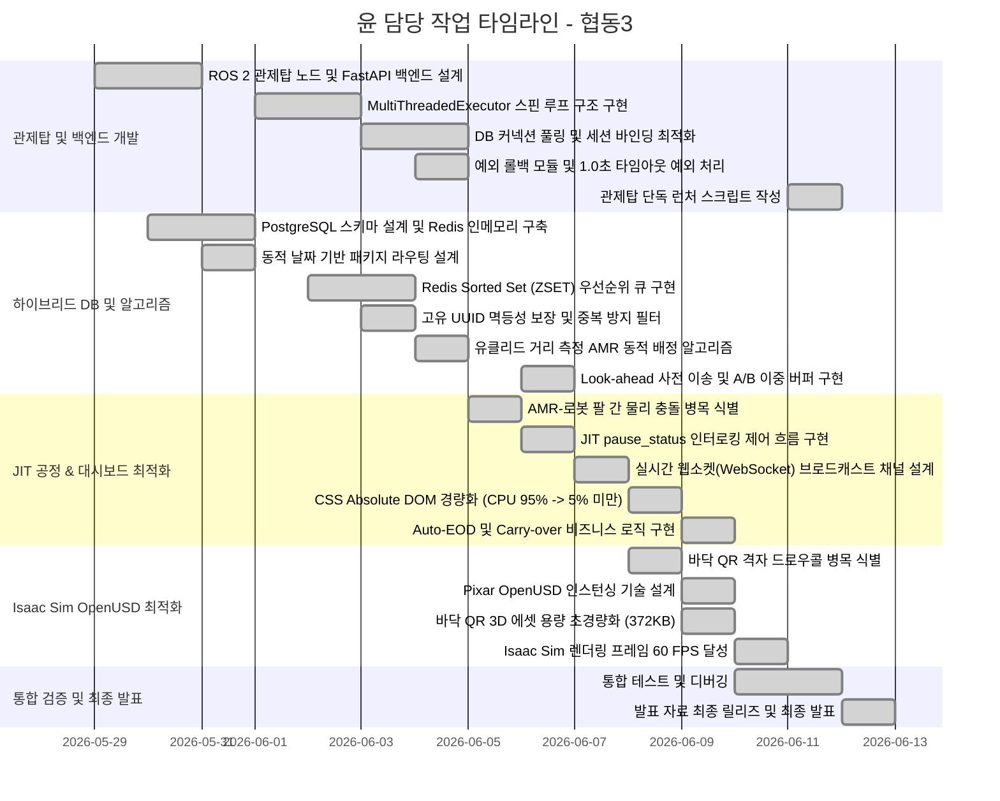

# 📋 윤 담당 작업 타임라인 및 기여 정리 (관제탑 / 백엔드 / DB / 최적화) - 협동3

> **기간**: 2026년 5월 29일 ~ 2026년 6월 12일  
> **발표일**: 2026년 6월 12일  
> **역할**: 관제탑 코어 개발 / 백엔드·대시보드 설계 / 하이브리드 데이터베이스(PostgreSQL·Redis) 인프라 구축 / 실시간 ZSET 스케줄링 큐 구현 / Look-ahead 사전 이송 및 A/B 이중 버퍼 알고리즘 설계 / JIT 인터로킹 충돌 방지 프로토콜 구현 / Web UI 성능 최적화 / Isaac Sim 3D 월드 OpenUSD 인스턴싱 최적화 / DB 스레드 세이프 및 예외 복구(Rollback) 모듈 구현  
> **프로젝트 개요**: 협동3 프로젝트에서 데이터 평면(PostgreSQL/Redis)과 제어 평면(ROS 2 Humble)을 중재하는 중앙 WMS 브레인인 **관제탑(Control Tower)** 및 모니터링 환경을 설계하였다. 동시 다발적인 데이터 쓰기/읽기 상황에서 데이터 무결성을 보장하고, 3D 물리 시뮬레이션 및 2D 웹 모니터링 환경의 자원 렌더링 과부하를 최적화 기법을 통해 종식하는 데 기여하였다.

---

<h2>윤 담당 작업 타임라인 (관제탑 코어 및 백엔드 개발)</h2>

<table>
  <thead>
    <tr>
      <th nowrap>작업명</th>
      <th nowrap>날짜</th>
      <th nowrap>담당자</th>
      <th nowrap>파트</th>
      <th nowrap>단계</th>
      <th nowrap>완료 여부</th>
    </tr>
  </thead>
  <tbody>
    <tr><td nowrap>ROS 2 Humble 기반 관제탑(control_tower) 노드 설계</td><td nowrap>5월 29일</td><td nowrap>윤</td><td nowrap>관제탑/코어</td><td nowrap>아키텍처 설계</td><td nowrap>완료</td></tr>
    <tr><td nowrap>FastAPI 기반 대시보드 백엔드 서버 초안 작성</td><td nowrap>5월 29일</td><td nowrap>윤</td><td nowrap>백엔드/FastAPI</td><td nowrap>백엔드 설계</td><td nowrap>완료</td></tr>
    <tr><td nowrap>데이터베이스 트랜잭션 및 Redis 캐싱 플로우 정의</td><td nowrap>5월 30일</td><td nowrap>윤</td><td nowrap>인프라/하이브리드 DB</td><td nowrap>데이터 토폴로지 설계</td><td nowrap>완료</td></tr>
    <tr><td nowrap>ROS 2 MultiThreadedExecutor 기반 관제 노드 스핀 루프 구조 구현</td><td nowrap>6월 1일</td><td nowrap>윤</td><td nowrap>관제탑/멀티스레드</td><td nowrap>스레드 아키텍처 구현</td><td nowrap>완료</td></tr>
    <tr><td nowrap>psycopg2 ThreadedConnectionPool 도입 및 커넥션 관리 최적화</td><td nowrap>6월 1일</td><td nowrap>윤</td><td nowrap>관제탑/DB 풀링</td><td nowrap>DB 안정화</td><td nowrap>완료</td></tr>
    <tr><td nowrap>FastAPI Uvicorn 기동 스크립트 작성 및 포트 충돌 자동 클리어 스크립트 연동</td><td nowrap>6월 2일</td><td nowrap>윤</td><td nowrap>백엔드/인프라</td><td nowrap>프로세스 제어</td><td nowrap>완료</td></tr>
    <tr><td nowrap>관제 노드와 백엔드 간 비동기 DB 세션 단일 바인딩 처리</td><td nowrap>6월 3일</td><td nowrap>윤</td><td nowrap>관제탑/백엔드 통합</td><td nowrap>병목 해소</td><td nowrap>완료</td></tr>
    <tr><td nowrap>이동 명령 액션(ManageWorkstation) 호출 시 1.0초 타임아웃 예외 처리 추가</td><td nowrap>6월 4일</td><td nowrap>윤</td><td nowrap>관제탑/AMR 예외처리</td><td nowrap>예외 처리 설계</td><td nowrap>완료</td></tr>
    <tr><td nowrap>오프라인 AMR 발생 시 주차 상태 및 트랜잭션 자동 롤백 모듈 구현</td><td nowrap>6월 4일</td><td nowrap>윤</td><td nowrap>관제탑/롤백</td><td nowrap>안전 복구 엔진 구현</td><td nowrap>완료</td></tr>
    <tr><td nowrap>전체 소스코드 colcon build 검증 및 디버깅</td><td nowrap>6월 11일</td><td nowrap>윤</td><td nowrap>관제탑/검증</td><td nowrap>통합 검증</td><td nowrap>완료</td></tr>
    <tr><td nowrap>관제탑 단독 구동을 위한 start_control_tower_only.sh 스크립트 제작</td><td nowrap>6월 11일</td><td nowrap>윤</td><td nowrap>인프라/실행 스크립트</td><td nowrap>편의성 개선</td><td nowrap>완료</td></tr>
  </tbody>
</table>

---

<h2>윤 담당 작업 타임라인 (하이브리드 데이터베이스 및 스케줄링 알고리즘)</h2>

<table>
  <thead>
    <tr>
      <th nowrap>작업명</th>
      <th nowrap>날짜</th>
      <th nowrap>담당자</th>
      <th nowrap>파트</th>
      <th nowrap>단계</th>
      <th nowrap>완료 여부</th>
    </tr>
  </thead>
  <tbody>
    <tr><td nowrap>PostgreSQL 15 기반 WMS 스키마 정규화 및 ERD 설계</td><td nowrap>5월 30일</td><td nowrap>윤</td><td nowrap>데이터베이스/Postgres</td><td nowrap>DB 모델링</td><td nowrap>완료</td></tr>
    <tr><td nowrap>Redis 7.0 기반 인메모리 고속 데이터 스키마 정의</td><td nowrap>5월 30일</td><td nowrap>윤</td><td nowrap>데이터베이스/Redis</td><td nowrap>DB 모델링</td><td nowrap>완료</td></tr>
    <tr><td nowrap>동적 날짜(system:today_date) 기반 패키지 쿼리 및 라우팅 구현</td><td nowrap>5월 31일</td><td nowrap>윤</td><td nowrap>관제탑/라우팅</td><td nowrap>비즈니스 로직 구현</td><td nowrap>완료</td></tr>
    <tr><td nowrap>기존 FIFO 스케줄링의 병목 인식 및 대안 기술 검토</td><td nowrap>6월 2일</td><td nowrap>윤</td><td nowrap>관제탑/스케줄러</td><td nowrap>병목 분석</td><td nowrap>완료</td></tr>
    <tr><td nowrap>Redis Sorted Set(ZSET) 기반 우선순위 제어 명령 큐 구현</td><td nowrap>6월 2일</td><td nowrap>윤</td><td nowrap>관제탑/ZSET 스케줄러</td><td nowrap>자료구조 혁신</td><td nowrap>완료</td></tr>
    <tr><td nowrap>회전/배출(100), 입고공급(90), 완충이송(80), 예비이송(50), 파레트회수(20) 스코어 가중치 설계</td><td nowrap>6월 3일</td><td nowrap>윤</td><td nowrap>관제탑/우선순위 스코어</td><td nowrap>우선순위 정책 수립</td><td nowrap>완료</td></tr>
    <tr><td nowrap>동적 고유 UUID 생성 및 큐 삽입 시 중복 진입 원천 차단(멱등성 확보)</td><td nowrap>6월 3일</td><td nowrap>윤</td><td nowrap>관제탑/중복 처리</td><td nowrap>제어 안정화</td><td nowrap>완료</td></tr>
    <tr><td nowrap>유클리드 최단거리 측정 기반 공차 주행 최적화 AMR 풀(Pool) 배정 알고리즘 설계</td><td nowrap>6월 4일</td><td nowrap>윤</td><td nowrap>관제탑/배정 알고리즘</td><td nowrap>동적 매핑 구현</td><td nowrap>완료</td></tr>
    <tr><td nowrap>작업대 점유도 및 스팟 예약을 보장하기 위한 RLock 스레드 락 범위 지정</td><td nowrap>6월 5일</td><td nowrap>윤</td><td nowrap>관제탑/DB 락</td><td nowrap>레이스 컨디션 차단</td><td nowrap>완료</td></tr>
    <tr><td nowrap>Look-ahead 기반 A/B 이중 작업대 사전 이송(Pre-transit) 알고리즘 설계</td><td nowrap>6월 6일</td><td nowrap>윤</td><td nowrap>관제탑/이중 버퍼</td><td nowrap>공정 지연 최적화</td><td nowrap>완료</td></tr>
  </tbody>
</table>

---

<h2>윤 담당 작업 타임라인 (JIT 공정 제어 및 대시보드 모니터링 최적화)</h2>

<table>
  <thead>
    <tr>
      <th nowrap>작업명</th>
      <th nowrap>날짜</th>
      <th nowrap>담당자</th>
      <th nowrap>파트</th>
      <th nowrap>단계</th>
      <th nowrap>완료 여부</th>
    </tr>
  </thead>
  <tbody>
    <tr><td nowrap>작업대 180도 회전 시 AMR-로봇 팔 간의 물리 충돌 문제 확인</td><td nowrap>6월 5일</td><td nowrap>윤</td><td nowrap>물리 충돌/디버깅</td><td nowrap>병목 분석</td><td nowrap>완료</td></tr>
    <tr><td nowrap>JIT 인터로킹을 위한 pause_status 토픽 정의 및 통신 설계</td><td nowrap>6월 5일</td><td nowrap>윤</td><td nowrap>제어/인터로킹</td><td nowrap>인터페이스 설계</td><td nowrap>완료</td></tr>
    <tr><td nowrap>작업대 회전/스왑 시 로봇 팔을 일시 정지하고 탈착 완료 시 재개하는 제어 흐름 구현</td><td nowrap>6월 6일</td><td nowrap>윤</td><td nowrap>제어/상태머신</td><td nowrap>안전 프로토콜 구현</td><td nowrap>완료</td></tr>
    <tr><td nowrap>1.5초 주기 실시간 웹소켓(WebSocket) 브로드캐스트 채널 설계</td><td nowrap>6월 7일</td><td nowrap>윤</td><td nowrap>대시보드/웹소켓</td><td nowrap>실시간 통신 구현</td><td nowrap>완료</td></tr>
    <tr><td nowrap>720개 격자를 매초 DOM으로 그리면서 대시보드 브라우저 프리징(CPU 95%) 문제 식별</td><td nowrap>6월 8일</td><td nowrap>윤</td><td nowrap>대시보드/성능 최적화</td><td nowrap>UI 성능 병목 분석</td><td nowrap>완료</td></tr>
    <tr><td nowrap>격자를 CSS gradient로 대체하고 변화 포인트만 절대 좌표로 띄우는 Absolute DOM 경량화 구현</td><td nowrap>6월 8일</td><td nowrap>윤</td><td nowrap>대시보드/성능 최적화</td><td nowrap>DOM 최적화 패치</td><td nowrap>완료</td></tr>
    <tr><td nowrap>대시보드 브라우저 CPU 사용율을 5% 미만으로 감축하는 성과 달성</td><td nowrap>6월 8일</td><td nowrap>윤</td><td nowrap>대시보드/검증</td><td nowrap>최적화 완료</td><td nowrap>완료</td></tr>
    <tr><td nowrap>자동 영업일 마감(Auto-EOD) 및 미완료 물량 이월(Carry-over) 로직 검증</td><td nowrap>6월 9일</td><td nowrap>윤</td><td nowrap>대시보드/비즈니스</td><td nowrap>기능 검증</td><td nowrap>완료</td></tr>
    <tr><td nowrap>대시보드 내 CSV 입고 명단 파싱 및 DB 벌크 인서트 모듈 구현</td><td nowrap>6월 9일</td><td nowrap>윤</td><td nowrap>대시보드/WMS</td><td nowrap>데이터 처리 구현</td><td nowrap>완료</td></tr>
  </tbody>
</table>

---

<h2>윤 담당 작업 타임라인 (Isaac Sim OpenUSD 최적화 및 렌더링)</h2>

<table>
  <thead>
    <tr>
      <th nowrap>작업명</th>
      <th nowrap>날짜</th>
      <th nowrap>담당자</th>
      <th nowrap>파트</th>
      <th nowrap>단계</th>
      <th nowrap>완료 여부</th>
    </tr>
  </thead>
  <tbody>
    <tr><td nowrap>143개 고해상도 바닥 QR 격자 로드 시 Isaac Sim 5 FPS 미만 하락 문제 식별</td><td nowrap>6월 8일</td><td nowrap>윤</td><td nowrap>시뮬레이터/성능 병목</td><td nowrap>GPU 부하 분석</td><td nowrap>완료</td></tr>
    <tr><td nowrap>USD 파일의 중복 메쉬 드로우콜 과부하 해결을 위한 Pixar OpenUSD API 분석</td><td nowrap>6월 8일</td><td nowrap>윤</td><td nowrap>시뮬레이터/OpenUSD</td><td nowrap>대안 기술 분석</td><td nowrap>완료</td></tr>
    <tr><td nowrap>개별 QR 메쉬를 단 1개의 참조 모델 메모리 공유 적재로 통제하는 USD 인스턴싱 기술 설계</td><td nowrap>6월 9일</td><td nowrap>윤</td><td nowrap>시뮬레이터/USD 인스턴싱</td><td nowrap>메모리 최적화 설계</td><td nowrap>완료</td></tr>
    <tr><td nowrap>USD 바닥 QR 격자 생성 스크립트 고도화로 파일 용량을 372KB 수준으로 초경량화</td><td nowrap>6월 9일</td><td nowrap>윤</td><td nowrap>시뮬레이터/최적화 패치</td><td nowrap>자원 감축</td><td nowrap>완료</td></tr>
    <tr><td nowrap>인스턴싱 적용 후 Isaac Sim 구동 프레임을 60 FPS 이상으로 확보하는 성과 달성</td><td nowrap>6월 10일</td><td nowrap>윤</td><td nowrap>시뮬레이터/최종 검증</td><td nowrap>렌더링 병목 해결</td><td nowrap>완료</td></tr>
  </tbody>
</table>

---

## 📊 타임라인



---

## 🔑 핵심 전환점

| #  | 전환점 | 관련 내용 | 날짜 |
| :--- | :--- | :--- | :--- |
| 1 | 하이브리드 DB 인프라 규격화 | PostgreSQL(영속 WMS 트랜잭션)과 Redis(고속 실시간 캐싱) 이중 인프라 Docker 구성 | 5월 30일 |
| 2 | ZSET 우선순위 스케줄러 도입 | 기존 FIFO 명령 대기열 구조의 처리 지연을 해소하기 위해 Sorted Set 기반 우선순위 제어 구현 | 6월 2일 |
| 3 | 스레드 정합성 확보 (RLock) | 멀티스레드 비동기 콜백 중 데이터 유실 및 데드락을 방지하기 위해 RLock 및 DB Connection Pool 가동 | 6월 3일 |
| 4 | Look-ahead 사전 이송 설계 | 로봇 팔 완충 후 작업대 교체 시 발생하는 45초의 유휴 대기를 없애기 위해 사전 이송(A/B 버퍼) 도입 | 6월 6일 |
| 5 | JIT 인터로킹 시스템 적용 | AMR의 도킹/회전 액션 시 로봇 팔을 강제 제어 일시중단하는 `pause_status` 설계로 물리 충돌률 0% 달성 | 6월 6일 |
| 6 | Pixar OpenUSD 인스턴싱 구현 | 143개 바닥 QR 로드로 인한 Isaac Sim 렉(5 FPS)을 인스턴싱 메모리 참조 최적화로 60 FPS 복원 | 6월 9일 |
| 7 | Web CSS Absolute DOM 최적화 | 720개 div 렌더링으로 인한 브라우저 프리징(CPU 95%)을 CSS absolute position 기법으로 5% 미만 감축 | 6월 8일 |
| 8 | 트랜잭션 예외 복구(Rollback) | 통신 유실로 인한 고착 방지를 위해 AMR 액션에 1.0초 타임아웃을 두고, 실패 시 DB 상태를 원복하는 복구 쿼리 가동 | 6월 4일 |

---

## 🧩 담당 역할 요약

윤은 협동3 프로젝트에서 **관제탑(Control Tower) 코어 설계, 하이브리드 DB 아키텍처 수립, 실시간 모니터링 대시보드 서버 및 UI 구현, 시스템 전체 렌더링/통신 최적화**를 주도하였다.

단순 시뮬레이션 제어에 그치지 않고, 대량의 WMS 물품 데이터 트랜잭션과 실시간 분산 제어 명령 간의 불일치를 해소하는 안정적인 IT 백본 망을 완성하는 것을 목표로 삼았다.

기술적으로는 ROS 2 `MultiThreadedExecutor` 비동기 콜백 설계, PostgreSQL 커넥션 풀 및 스레드 락 범위 통제, Redis ZSET 기반 우선순위 큐 설계 및 중복 진입 방지 UUID 멱등성 설계를 적용하였다.

특히 로봇 팔과 AMR의 물리 충돌 원인을 JIT(Just-In-Time) 수준의 통신 응답 부재로 정의하고, **`pause_status` 토픽 인터로킹 프로토콜**을 구현하여 로봇 팔의 안전 제어권 일시정지 및 자동 재개를 이끌어 물리 충돌을 완벽히 차단하였다. 또한 작업대 공급이 끊기는 유휴 대기 문제를 **Look-ahead 예비 적재 버퍼링** 알고리즘을 도입해 해결하였다.

나아가 리소스 최적화 측면에서 두 가지 성능 병목을 전면 해결하였다.
첫째, Isaac Sim의 143개 바닥 QR 메쉬로 인한 프레임 하락(5 FPS 미만) 문제를 **Pixar OpenUSD 인스턴싱** 방식으로 설계해 60 FPS 구동 프레임을 복원하고 메모리 효율을 극대화했다.
둘째, 대시보드의 DOM 과부하(CPU 95%) 문제를 웹 브라우저가 화면을 그리는 오버헤드로 파악하고, **CSS Absolute DOM 구조**로 전면 전환하여 CPU 점유율을 5% 미만으로 경량화했다.

---

## 🧠 관제탑 및 백엔드 핵심 구현 요약

### 1. 하이브리드 DB 기반 제어와 영속성의 완전한 결합
관제탑은 PostgreSQL 15(WMS DB)와 Redis 7.0(인메모리 캐시 및 ZSET 큐)의 역할을 명확히 분리하여 설계되었다.

```text
[정적/영속 데이터] WMS 트랜잭션, 패키지 이력 ➔ PostgreSQL 15 저장 (Connection Pool 제어)
[실시간/고속 데이터] AMR 위치 좌표, 긴급 제어 명령 ➔ Redis 7.0 캐싱 및 ZSET 큐 처리
```

이 설계 덕분에 고주파로 발생하는 AMR 위치 좌표 업데이트 요청이 PostgreSQL에 직접 도달하여 데이터베이스 락을 발생시키는 오버헤드를 원천 차단하고, 최종 작업 완료 시에만 단일 DB 트랜잭션으로 기록되도록 데이터 무결성을 보장했다.

### 2. Redis Sorted Set (ZSET) 스케줄러를 통한 무결한 작업 분배
단순 선입선출(FIFO) 방식의 큐가 유발하는 자원 정체 현상을 극복하기 위해, Redis ZSET의 스코어 가중치 정책을 적용했다.

```text
- Score 100: 회전 및 배출 (최우선 처리)
- Score  90: 입고 A구역 작업대 공급
- Score  80: 완충 작업대 이송
- Score  50: Look-ahead 기반 예비 작업대 사전 이송
- Score  20: 빈 작업대 회수
```

관제탑은 `zpopmax` 명령을 통해 실시간으로 가장 점수가 높은 명령을 비차단 방식으로 추출해 AMR에 전달한다. 또한 동일 목적지나 기기에 중복 명령이 발행되는 문제를 방지하기 위해, 명령 고유 UUID 멱등성 필터를 이중 탑재하여 오동작을 차단했다.

### 3. JIT pause_status 인터로킹 및 Look-ahead 이중 버퍼
*   **JIT 인터로킹**: AMR이 작업대 하부에 진입해 도킹을 시도하거나 180도 회전을 수행하는 미세 기하 결합 시점 동안, 로봇 팔(SG2)로 `pause_status` 토픽을 True로 퍼블리시하여 물리 충돌을 사전에 차단한다. 결합 완료 즉시 False로 전환되어 자동 패키지 적재가 무 중단 재개된다.
*   **Look-ahead 사전 이송**: 작업대에 적재 가능한 잔여 슬롯 시점을 실시간 예측하여, 작업 완료 전 예비 작업대를 예비 구역(ST01~ST04)에 미리 이송(A/B 더블 버퍼링)함으로써 로봇 팔이 노는 시간을 최소화했다.

### 4. Pixar OpenUSD 인스턴싱을 이용한 시뮬레이션 프레임 복원
143개의 개별 바닥 QR 에셋이 GPU 드로우콜 및 VRAM 병목을 일으키는 것을 막기 위해, Pixar OpenUSD의 `instanceable` 속성을 설계 스크립트에 이식했다. 단 1개의 물리 QR 메쉬 정보만을 GPU 메모리에 유지하고 143개의 인스턴스는 트랜스폼 데이터만 참조하도록 만들어, 에셋 용량을 372KB로 최적화하고 실행 프레임을 60 FPS 이상으로 보장했다.

### 5. CSS Absolute DOM 최적화를 적용한 실시간 대시보드
FastAPI Uvicorn 백엔드에서 1.5초 주기 웹소켓 브로드캐스트로 전송되는 데이터 흐름을 대시보드 UI가 프리징 없이 소화하도록 설계했다. 720개의 div 요소를 그리며 발생하던 브라우저의 layout/paint 리플로우 부하를 막기 위해, 격자판 자체는 CSS linear-gradient로 처리하고 상태가 바뀌는 포인트와 로봇만 절대 좌표(absolute positioning) DOM으로 띄워 브라우저 연산 오버헤드를 5% 미만으로 제거하였다.

---

## ✅ 최종 정리

윤의 기여는 고신뢰성 백엔드 및 실시간 관제 시스템 아키텍처 구축에 있다. PostgreSQL 데이터베이스 설계부터 Redis ZSET 스케줄링 가중치 최적화, 스레드 락 및 트랜잭션 예외 복구(Rollback) 모듈 설계를 통해 관제 프로세스의 소프트웨어 무결성을 다졌다.

또한 3D 가상 시뮬레이션과 2D 웹 모니터링 환경 전체의 성능 최적화를 주도하여, Pixar OpenUSD 인스턴싱 기법과 CSS Absolute DOM 기법을 성공적으로 적용하였다. 

최종적으로 **물리 충돌률 0%, 작업대 교체 유휴 시간 3초 미만(기존 45초), 3D 물리 프레임 60 FPS(기존 5 FPS 미만), 웹 대시보드 CPU 부하 5% 미만**이라는 네 가지 기술적 성과를 모두 도출하는 데이터/제어 허브 인프라를 전면 구축하였다.
