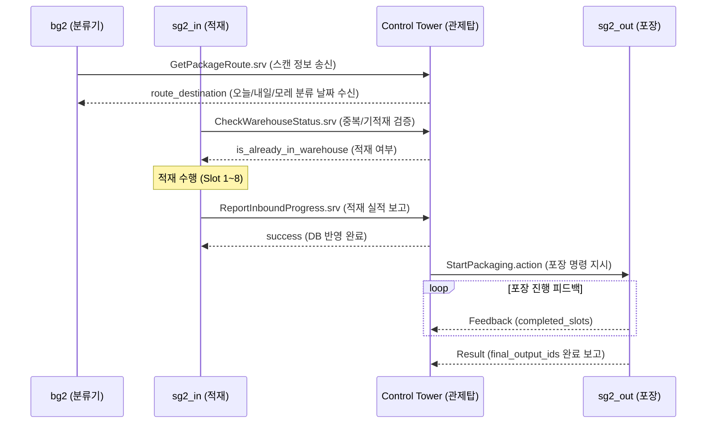

# 🤖 설비 로봇(입/출고 분류기 및 매니퓰레이터) 담당자용 연동 명세서
> **문서 대상**: 컨베이어 sorter (`bg2`), 적재 로봇 (`sg2_in_01~03`), 포장 로봇 (`sg2_out_00`) 개발 담당자
> **작성 목적**: 각 로봇 설비와 중앙 관제탑(Control Tower) 간의 ROS 2 서비스 및 액션 인터페이스 세부 규격 정의.

---

## 🔍 1. 설비 로봇별 역할 및 통신 아키텍처
모든 설비 로봇은 관제탑 노드(`control_tower_node`)를 서비스 서버 또는 액션 클라이언트로 두고 연동합니다.



---

## 1️⃣ 컨베이어 3방향 분류 로봇 (`bg2`)
* **역할**: 진입한 택배 박스의 QR 바코드를 스캔하여 배송일자별로 1~3번 라인에 알맞게 정밀 3방향 푸싱 분류를 수행합니다.
* **관제탑 호출 서비스**: `GetPackageRoute.srv`

### 📄 `GetPackageRoute.srv` 인터페이스 규격
* **서비스 명칭**: `/get_package_route` (유형: `cobot3_interfaces/srv/GetPackageRoute`)

#### Request
| 필드명 | 타입 | 설명 |
| :--- | :--- | :--- |
| `package_id` | `string` | 상자 바코드 ID (기본적으로 비어있을 수 있음) |
| `customer_name` | `string` | 수령인 성함 (기본적으로 비어있을 수 있음) |
| `qr_id` | `string` | 바코드에서 스캔한 QR코드 원본 문자열 (예: `"PKG_RAND_001"`) |

#### Response
| 필드명 | 타입 | 설명 |
| :--- | :--- | :--- |
| `route_destination` | `string` | 분류 목적지 배송일자 문자열 (예: `"2026-06-08"`) |

#### 💡 분류 라인 매핑 규칙 (bg2 제어 로직 적용 사항)
반환받은 `route_destination` 날짜를 관제탑의 오늘/내일/모레 기준 정보와 대조하여 다음과 같이 물리 컨베이어 분류기를 제어합니다.
* **오늘 (Today)** 날짜 물량 ➡️ **1번 라인 (`sg2_in_01`)**으로 푸싱 분류
* **내일 (Tomorrow)** 날짜 물량 ➡️ **2번 라인 (`sg2_in_02`)**으로 푸싱 분류
* **모레 (Day After)** 날짜 물량 ➡️ **3번 라인 (`sg2_in_03`)**으로 푸싱 분류

---

## 2️⃣ 적재 매니퓰레이터 로봇 (`sg2_in_01`, `sg2_in_02`, `sg2_in_03`)
* **역할**: 분배된 패키지를 A/B 버퍼에 대기 중인 2x4 작업대(슬롯 1~8번)에 순차적으로 파이프라이닝 적재합니다.
* **사용 서비스**: `CheckWarehouseStatus.srv`, `ReportInboundProgress.srv`

### ① `CheckWarehouseStatus.srv` (적재 시작 전 필수 검증)
* **서비스 명칭**: `/check_warehouse_status`
* **목적**: 동일 수령인의 패키지가 이미 입고되어 보관 중인지 중복 검사하여 **창고 직송 예외 처리** 대상인지 판정합니다.

#### Request / Response
```text
# Request
string customer_name      # 택배 수령인명
string package_id         # 택배 고유 ID
string qr_id              # 택배 QR코드 ID

---
# Response
bool is_already_in_warehouse  # 중복 여부 (true: 이미 있음 -> 적재 스킵 / false: 신규 적재)
```
> [!IMPORTANT]
> `is_already_in_warehouse`가 `true`로 반환되면, 해당 패키지는 작업대에 싣지 않고 컨베이어 회수 벨트 등으로 Bypass 처리해야 합니다. (이후 AMR이 와서 창고 직송으로 직접 회수하게 됨)

### ② `ReportInboundProgress.srv` (적재 실적 실시간 보고)
* **서비스 명칭**: `/report_inbound_progress`
* **목적**: 작업대에 물품 1개를 적재할 때마다 호출하여 적재 현황을 DB와 실시간 동기화합니다.

#### Request / Response
```text
# Request
string workstation_id     # 작업대 ID (예: "WS01")
string robot_id           # 보고하는 로봇 식별자 (예: "sg2_in_01")
int32 filled_slots_count  # 적재된 슬롯 번호 (1 ~ 8)
string package_id         # 적재한 패키지 ID
string workstation_qr_id  # 작업대 QR코드 ID (예: "WORKSTATION_WS01")
string package_qr_id      # 적재된 패키지 QR코드 ID

---
# Response
bool success              # DB 반영 성공 여부 (true / false)
```

---

## 3️⃣ 출고 포장 매니퓰레이터 로봇 (`sg2_out_00`)
* **역할**: 출고 라인 A/B 버퍼에 배치된 작업대의 적재 물품들을 포장하고 고유 출고 ID(송장 바코드)를 발행합니다.
* **역할군**: **ROS 2 Action Server**로 동작해야 합니다.
* **관제탑 호출 액션**: `StartPackaging.action`

### 📄 `StartPackaging.action` 인터페이스 규격
* **액션 명칭**: `/start_packaging` (유형: `cobot3_interfaces/action/StartPackaging`)

#### Goal / Feedback / Result
```text
# Goal Definition
string workstation_id       # 포장 작업을 수행할 작업대 ID (예: "WS01")
string today_date           # 오늘 영업일 날짜 YYYYMMDD (예: "20260608")
string workstation_qr_id    # 작업대 고유 QR코드 ID

---
# Result Definition
bool success                # 전체 포장 공정 완료 성공 여부
string[] final_output_ids   # 발행된 고유 출고(송장) ID 리스트

---
# Feedback Definition
int32 completed_slots       # 현재 완료한 누적 슬롯 개수 (1 ~ 8)
string last_packed_slot     # 직전에 포장 완료된 슬롯 번호 (예: "slot_3")
```

#### 💡 고유 출고 ID (final_output_ids) 규격 규칙
포장 로봇 제어기는 각 슬롯의 포장이 완료될 때마다 아래 포맷으로 고유한 출고 바코드 문자열을 만들어 Result 배열에 담아야 합니다.
* **포맷**: `[포장로봇ID]_[작업대ID]_SLOT[슬롯번호]_[YYYYMMDD]_[HHMMSS]`
* **예시**: `sg2_out_00_WS01_SLOT3_20260608_121545`
* 이 출고 ID는 최종 Result 보고 시 관제탑에 전달되어 PostgreSQL의 `packages` 테이블 내 `outbound_id` 컬럼과 `status = 'COMPLETED'` 상태로 즉시 저장됩니다.
