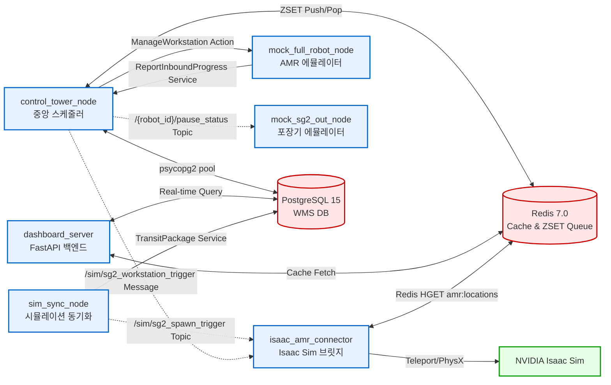
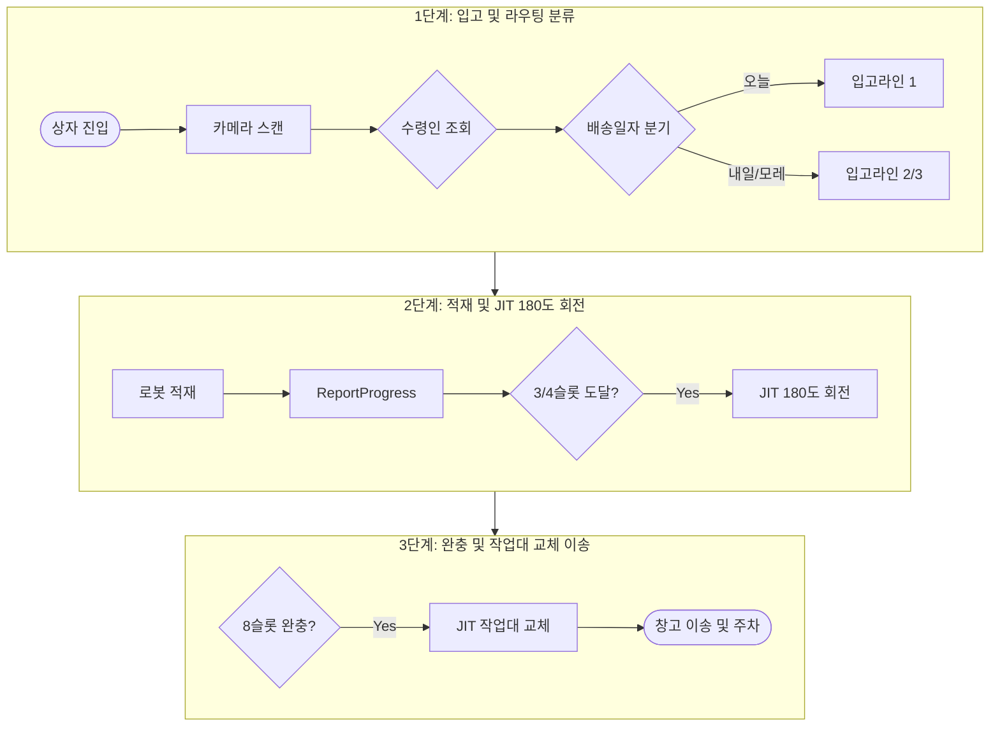
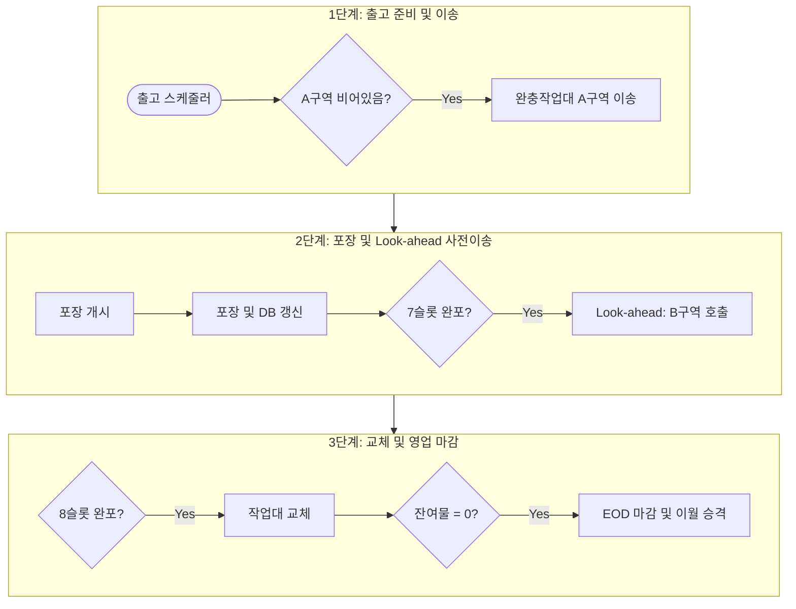
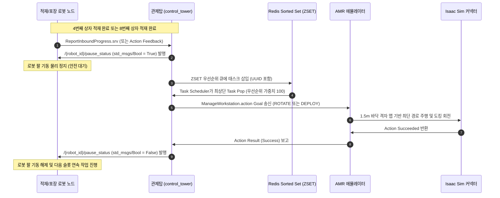
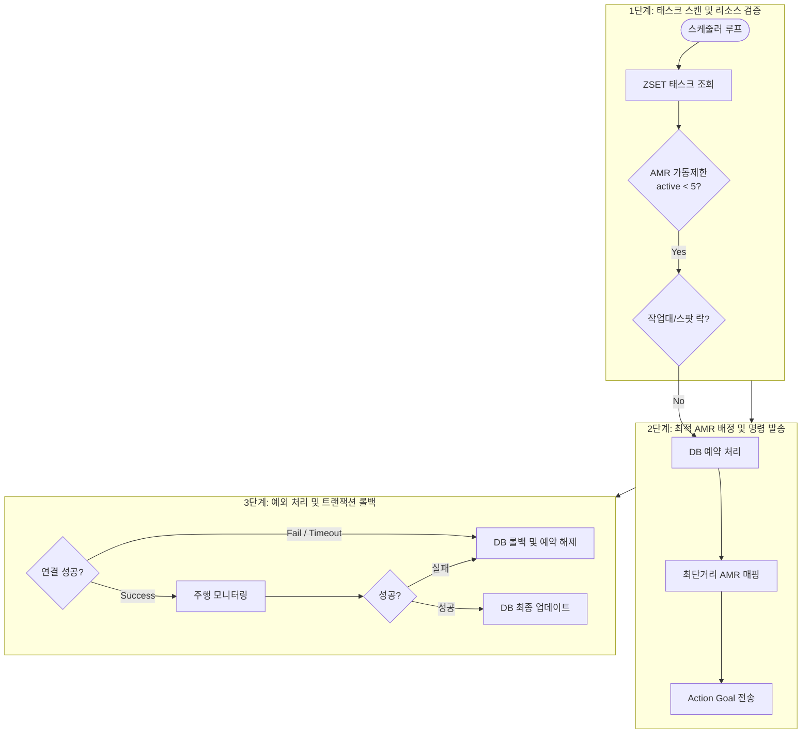

# 📡 관제탑 노드 토폴로지 및 파이프라인 시스템 아키텍처

본 문서는 물류창고 관제 시스템(Control Tower)을 구성하는 핵심 ROS 2 노드들의 데이터 흐름, 시스템 아키텍처, 그리고 제어 파이프라인을 시각화(Mermaid) 및 기술적으로 정리한 아키텍처 명세서입니다.

---

## 📌 1. 시스템 노드 & 데이터 토폴로지 (Node & Data Topology)

관제 시스템은 제어 평면(ROS 2 Humble / DDS)과 데이터 평면(PostgreSQL / Redis)이 분리된 하이브리드 아키텍처를 채택하고 있습니다. 각 노드 간의 통신 채널과 데이터 접근 모델은 다음과 같이 정의됩니다.

---

## 🔄 2. 입출고 물류 파이프라인 플로차트 (Logistic Pipeline Flowcharts)

### ① 입고분류 및 적재 파이프라인 (Inbound Pipeline)
상자가 입고 컨베이어 벨트에 진입한 순간부터 AMR이 적재 완료된 작업대를 보관 구역으로 이송하기까지의 전체 제어 흐름입니다.

### ② 출고 및 포장 파이프라인 (Outbound Pipeline)
오늘 배송해야 하는 패키지들을 선별하고, 포장 로봇이 포장을 수행한 뒤 영업일을 마감하는 과정입니다.

---

## ⚡ 3. JIT 일시정지 및 인터로킹 시퀀스 (JIT Interlocking Sequence)

로봇 팔(Manipulator)의 적재/포장 물리 좌표 영역과 AMR의 주입/탈출 공간이 겹치는 물리 충돌 병목을 원천 방지하기 위해 설계된 시퀀스 다이어그램입니다.

---

## 🛡️ 4. AMR 스케줄러 & 트랜잭션 롤백 흐름 (Scheduler & Rollback Flow)

AMR 배정 시 동시 기동 제약 조건을 준수하고, 통신 지연이나 로봇 오프라인 상황에서 데이터베이스 교착 상태를 복구하는 예외 처리 아키텍처입니다.

