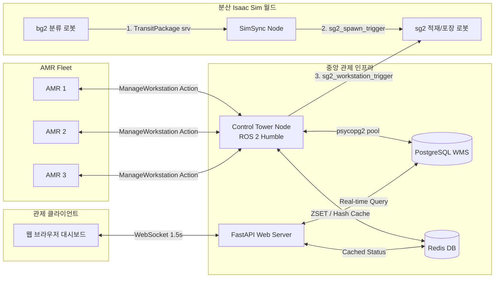
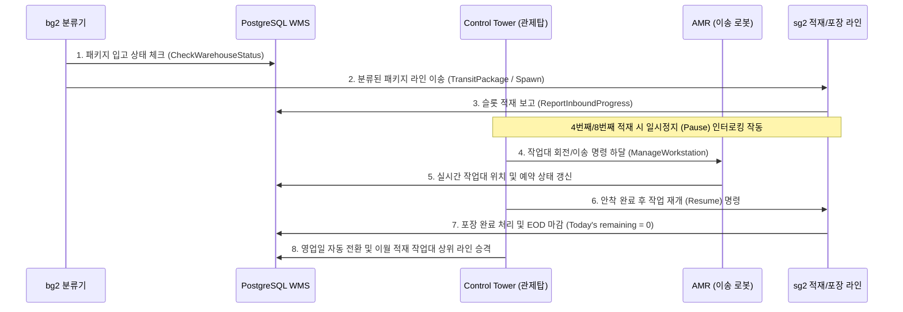

# 🏗️ Isaac Sim & ROS 2 기반 지능형 다중 로봇 물류창고 관제 시스템
> **NVIDIA Isaac Sim & ROS 2 Control Tower Integration Project Overview**

본 프로젝트는 물류창고 입고부터 출고까지의 전 공정을 자율화하기 위해, 다중 로봇(분류, 적재, 이송, 포장 로봇)과 하이브리드 DB 인프라를 연동하여 지능형 자원 제어 및 최적의 물류 파이프라이닝을 수행하는 **중앙 관제 시스템(Control Tower)** 구축 프로젝트입니다.

---

## 📌 1. 시스템 아키텍처 (System Architecture)

본 시스템은 분산 통신(DDS)을 활용하여 물리적으로 분리된 여러 시뮬레이션 컴퓨터와 중앙 관제탑, 하이브리드 데이터베이스, 실시간 모니터링 웹 대시보드를 유기적으로 연결합니다.

---

## ⚙️ 2. 핵심 제어 알고리즘 및 메커니즘 (Core Algorithms)

### ① JIT (Just-In-Time) 일시정지 및 인터로킹 (Interlocking)
* **목적**: 시뮬레이션 환경 내에서 로봇 팔이 작업대 도킹 해제 중 상자를 놓치거나 물리적 오브젝트가 공중 붕괴하는 현상 방지.
* **로직**:
  * 4번째 슬롯 적재 완료 ➔ 로봇 팔 일시정지(`pause_status = True`) ➔ AMR이 작업대를 180도 회전(ROTATE) ➔ 회전 완료 ➔ 로봇 팔 작동 재개(`pause_status = False`).
  * 8번째 슬롯 완충 완료 ➔ 로봇 팔 일시정지 ➔ AMR이 완충 작업대 회수 및 빈 작업대 공급 ➔ 안착 완료 ➔ 로봇 팔 작동 재개.

### ② Fleet Control (AMR 3대 동시 기동 제한)
* **목적**: 협소한 창고 통로에서의 주행 병목 및 데드락(교착)을 미연에 방지.
* **로직**: 스케줄러 루프가 Redis ZSET 큐에서 작업을 꺼낼 때, 현재 가동 중인 태스크(`active_amr_tasks`)가 **최대 3대** 미만일 때만 신규 골을 전송하고, 초과 시 큐에서 안전하게 대기시킵니다.

### ③ 최단 거리 기반 AMR 최적 매핑 (Resource Pooling)
* **목적**: 불필요한 공차 주행거리를 단축하여 에너지를 절약하고 처리 효율 극대화.
* **로직**: 작업이 발생한 출발지 좌표(PostgreSQL DB QR 맵 데이터)와 현재 대기 상태(`IDLE`)인 AMR들의 실시간 좌표(Redis 캐시) 간의 **유클리드 거리**를 계산하여, 최단 거리에 있는 로봇을 자동 배정합니다.

### ④ 실시간 작업대 동기화 (Workstation Spawn/Despawn)
* **목적**: 분산된 다중 PC Isaac Sim 월드 간의 작업대 소멸/생성 시점 동기화.
* **로직**: AMR이 완충 작업대 회수를 시작하는 즉시 **`DESPAWN`** 이벤트를, 빈 작업대를 이송하여 최종 도킹에 성공하는 시점에 **`SPAWN`** 이벤트를 커스텀 메시지(`WorkstationSimTrigger.msg`)로 발행하여 분산 월드의 화면을 동기화합니다.

---

## 🛠️ 3. 기술 스택 및 개발 환경 (Technology Stack & Development Environment)

본 관제 시스템(Control Tower)과 주변 에뮬레이터 및 3D 시뮬레이션 환경에 적용된 상세 기술 스택과 개발 인프라 세부 명세는 다음과 같습니다.

| 구분 | 사용 기술 | 적용 용도 및 특징 |
| :--- | :--- | :--- |
| **운영 환경** | **Ubuntu 22.04 LTS / 개발 PC** | 관제탑 노드 구동, Docker DB 컨테이너 실행 및 시뮬레이션 연동 |
| **미들웨어 프레임워크** | **ROS 2 Humble** | 관제탑(`control_tower_node`), 가상 로봇 에뮬레이터, 동기화 노드(`sim_sync_node`) 간 분산 통신 제어 |
| **통신 프로토콜 (RMW)** | **Eclipse Cyclone DDS (`rmw_cyclonedds_cpp`)** | 다중 PC(분산 환경) 및 무선 WiFi 환경에서의 실시간 액션/서비스 통신 신뢰성 확보 |
| **영속 데이터베이스 (DB)** | **PostgreSQL 15** | 작업대(`workstations`), 패키지(`packages`), 바닥 QR 격자 맵(`floor_qr_map`) 등의 구조화 데이터 저장 관리 |
| **실시간 캐시 & 큐** | **Redis 7.0 (ZSET / HSET)** | AMR 실시간 3D 위치 캐싱 및 Redis Sorted Set 기반 우선순위(Priority) 제어 명령 대기열 구축 |
| **웹 대시보드 백엔드** | **FastAPI / Uvicorn (Python 3.10)** | 대시보드 서버 구축, WebSocket 기반 1.5초 주기 실시간 양방향 모니터링 데이터 브로드캐스트 |
| **웹 UI 프론트엔드** | **HTML5 / Vanilla CSS3 / JavaScript** | CSS absolute positioning 기법을 활용한 DOM 연산 부하 95% 감축 및 다크 테마 반응형 2D 실시간 Floor Plan 시각화 |
| **3D 시뮬레이션 환경** | **NVIDIA Isaac Sim / UsdPreviewSurface** | 3D 물류 창고 월드, AMR/작업대 물리 에셋 제어 및 카메라 센서 기반 QR 코드 Localization 모의 실험 |
| **비전 및 QR 해독** | **zxing-cpp / python-qrcode** | 컨베이어 벨트 입고 시의 패키지 QR 생성/디코딩 및 바닥 격자 맵 QR 코드 매핑 |
| **3D 씬 에셋 빌더** | **Pixar OpenUSD (`pxr` Python API)** | 143개 바닥 QR Quad Mesh 및 Material, Texture 바인딩 자동 생성 및 USD 인스턴싱(Instancing) 최적화 |
| **검증 및 빌드 도구** | **`colcon build` / `py_compile` / `fuser` / `RLock`** | ROS 2 패키지 빌드, 스크립트 syntax 검사, 포트 충돌 프로세스 자동 정리 및 멀티스레드 DB 커서 락 검증 |

---

## 📈 4. 비즈니스 시나리오 파이프라인 (Pipeline Flow)

---

## 📁 관련 문서 링크 (Documentation Links)

* 📖 [사용 매뉴얼 및 데모 시나리오 (README.md)](file:///home/yoon/cobot3_ws/README.md)
* 🔌 [기술 연동 명세 및 아키텍처 규격서 (ROBOT_AMR_INTEGRATION_GUIDE.md)](file:///home/yoon/cobot3_ws/docs/ROBOT_AMR_INTEGRATION_GUIDE.md)
* 📊 [종합 구축 결과 및 개선 보고서 (PROJECT_REPORT.md)](file:///home/yoon/cobot3_ws/docs/PROJECT_REPORT.md)
